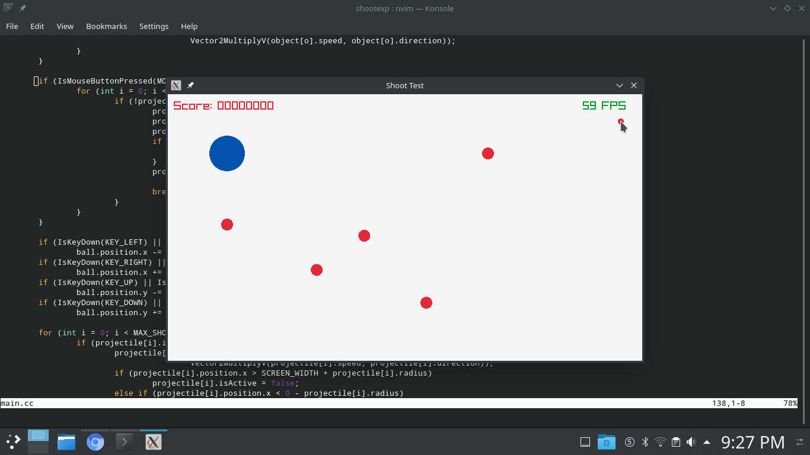

# Shooter Experiment

A simple shooter experiment game written in C++ using the [raylib](https://www.raylib.com/) game engine.

## Building & Running

Requires raylib to build, which you can grab from [here](https://github.com/raysan5/raylib).

```sh
$ make
$ ./game
```

## Screenshots

